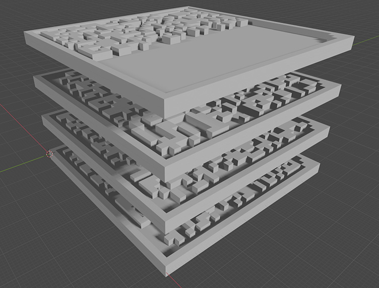

# 你的纪念碑！

事情是这样的，最近好像人类要灭亡了嘛，于是我就想，有没有办法给未来出现在地球上的智慧生物留下什么信息做纪念呢？

然后我突然想起来，之前GitHub不是把代码刻在胶片上，埋到北极去了嘛。那我也可以发明1个通用的便宜版，就刻在塑料上，这样1来每个人都可以把纪念埋在家里啦！


## 效果

只要输入1串任意的bytes，就可以把它们的2进制数据生成1组3D模型，然后你就可以把它们送到3D打印机里制造纪念碑啦！

就像这样——




## 使用方法

首先你需要1个Python，然后:

```sh
pip install git+https://github.com/RimoChan/thyrune.git
```

函数只有1个，是`碑`，定义是这样的: 

```python
def 碑(data: bytes, X: int = 32, Y: int = 32, S: float = 2) -> List[mesh.Mesh]: ...
```

其中`data`是你要刻在碑上的数据，`X`和`Y`是每1层的尺寸(不含边框，单位通常是毫米)，`S`是模型整体缩放的倍数。

返回1组`Mesh`，每个对象表示碑的1层。


使用例:
```python
import numpy as np
from thyrune.碑 import 碑

data = np.random.bytes(450)
for i, m in enumerate(碑(data)):
    m.save(f'碑{i}.stl')
```

这样1来450个字节就会生成4个碑层的stl文件，接下来去把它们打印出来，就可以埋进土里等未来的智慧生物来挖啦！


## 注意

1. 不要使用可降解的材料打印，1般买打印机送的那个PLA是不行的。尽量使用聚乙烯等难降解的材料打印。

2. 但是普通的塑料直接埋在土里好像过1000年就降解了，所以你可以再买1个玻璃罐子放进去再埋。

3. 如果人类没有灭亡，也可以把纪念碑放在你的坟墓里。以后未来的考古学家来了，别人的墓碑上只能刻2句话，你可以给考古学家放mp3！


## 结束

就这样，我要返回额外卡组了，大家88！
